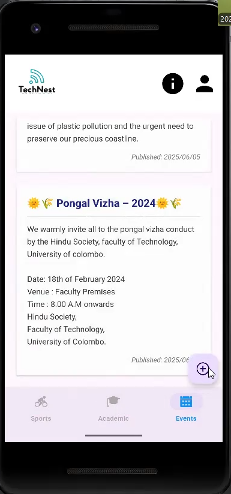

# 📱 TechNest – Faculty News Android App

## 🧩 Project Overview

TechNest is a mobile app designed to deliver real-time news and updates for faculty members and students. The app covers key categories such as:

- ⚽ Sports News  
- 🎉 Events  
- 📚 Academic Announcements  

Users can log in securely and manage news content with full **CRUD (Create, Read, Update, Delete)** functionality, all powered by **Firebase Realtime Database**.

---

## 🧱 Technology Stack

- **Android Studio** with Java and XML  
- **Firebase Realtime Database** for backend data storage  
- **Firebase Authentication** for user login and security  
- **Firebase SDKs** integrated for seamless real-time updates  

---

## 🚀 Features

- 🔐 User authentication (sign up, sign in, sign out)  
- 📰 Real-time news feed with categories (sports, events, academics)  
- 🔄 Live synchronization of data using Firebase Realtime Database  
- 📱 Clean and intuitive UI using XML layouts  

---

👨‍💻 Author
janidu Gamlath
